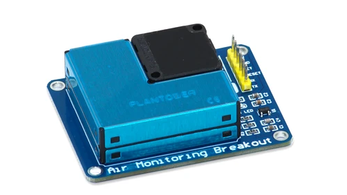

# Air Monitoring Breakout

SB Components developed the Air Monitor HAT for Raspberry Pi an open-source portable sensor that has the ability to provide the level of quantity of the suspended particulates with their mass.

Buy it from : https://shop.sb-components.co.uk/collections/breakouts/products/air-monitoring-breakout



## Pinout (Internally connected via header)

| Breakout Pins       | Raspberry Pi Pins |
| ----------------    | ----------------- |
| 5V     	            | 5V      |
| GND     	          | GND     |
| PMS RX              | GPIO14  |
| PMS TX              | GPIO15  |
| PMS SET             | GPIO27  |
| PMS RESET           | GPIO17  |


### Enable I2C and Serial Interface

 Open a terminal and run the following commands to enable I2C and Serial：


* ``` sudo raspi-config ```

Choose Interfacing Options -> I2C ->yes 


* ``` sudo raspi-config ```

Choose Interfacing Options -> Serial -> No -> Yes


## Testing

### Clone Repository

``` git clone https://github.com/sbcshop/Air-Monitoring-Breakout.git ```

``` cd Air-Monitoring-Breakout ```

Run example code by running below command:

``` python3 read_example.py ```


